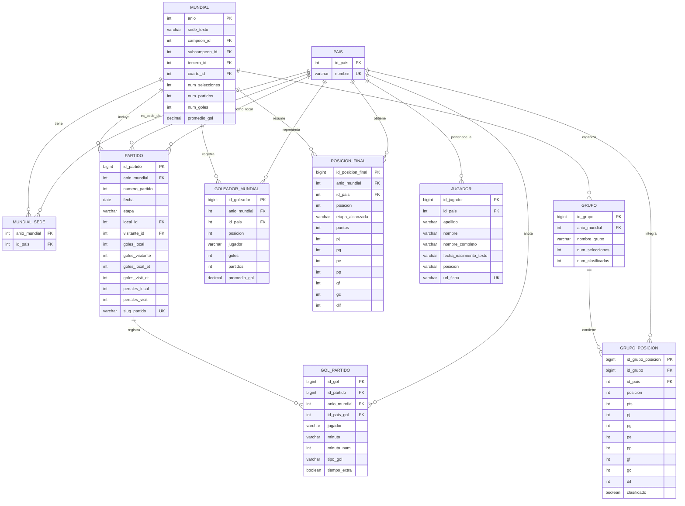

# Modelo ER

## Alcance

El modelo fue construido a partir de los CSV ya existentes en `output_csv/` y del
enunciado del proyecto. El objetivo es poder consultar:

- informacion general por mundial,
- partidos y resultados,
- posiciones finales,
- goles detallados,
- goleadores,
- informacion por pais,
- informacion de grupos cuando esa fuente este disponible.

## Entidades principales

### `pais`

Catalogo unico de selecciones o paises participantes.

### `mundial`

Contiene el resumen por anio del mundial.

### `mundial_sede`

Relaciona un mundial con uno o varios paises sede. Se separa de `mundial` porque un
mundial puede tener mas de una sede, por ejemplo `Corea / Japon`.

### `partido`

Guarda cada partido del mundial, con fecha, etapa, marcador, tiempo extra y penales.

### `gol_partido`

Detalle de goles anotados por partido.

### `goleador_mundial`

Tabla historica de goleadores por mundial.

### `posicion_final`

Tabla de posiciones finales por mundial.

### `grupo`

Representa cada grupo de un mundial.

### `grupo_posicion`

Posiciones de cada seleccion dentro de cada grupo.

### `jugador`

Catalogo de jugadores extraidos desde las fichas del sitio.

## Relaciones

- Un `pais` puede aparecer en muchos `mundiales` como campeon, subcampeon, tercero o cuarto.
- Un `mundial` puede tener uno o varios `mundial_sede`.
- Un `mundial` tiene muchos `partidos`.
- Un `partido` tiene muchos `gol_partido`.
- Un `mundial` tiene muchas filas en `goleador_mundial`.
- Un `mundial` tiene muchas filas en `posicion_final`.
- Un `mundial` puede tener muchos `grupo`.
- Un `grupo` tiene muchas filas en `grupo_posicion`.
- Un `pais` puede tener muchos `jugador`.

## Diagrama entidad relacion

## Notas de modelado

1. Se uso `pais` como catalogo central para selecciones y sedes.
2. Las sedes se normalizaron con una tabla intermedia porque un mundial puede tener mas
   de un pais anfitrion.
3. `slug_partido` se almacena para relacionar facilmente `partido` con `gol_partido`.
4. Los datos de grupo quedaron modelados.
5. La fecha de nacimiento del jugador se conserva como texto para no perder informacion original del sitio.
